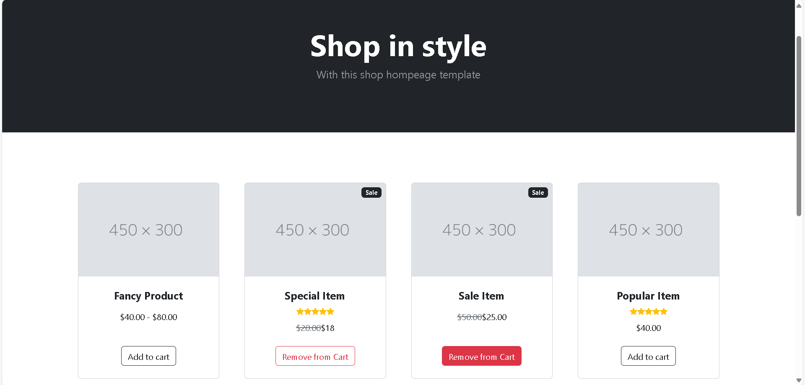
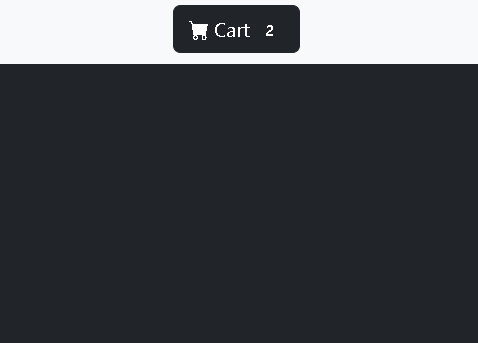

# 🛍️ React Shopping Homepage  

📌 **Project Type:** MERN Stack (Frontend)  
🚀 **Live Demo:** [View Here](https://your-vercel-deployment-link.vercel.app)  
---

## 📖 Overview  

The **React Shopping Homepage** is a modern, interactive, and user-friendly e-commerce frontend built with **React.js**. This mini-project simulates a shopping cart experience, where users can browse products, add/remove items from the cart, and manage their selections dynamically.  

---

## 🎯 Features  

✅ **Product Display** – Organized product listing with details like name, price, and image.  
✅ **Add to Cart** – Click the **"Add to Cart"** button to add products dynamically.  
✅ **Cart Management** – Users can remove items from the cart anytime.  
✅ **Real-Time Updates** – The cart updates automatically when items are added or removed.  
✅ **Local Storage** – Cart persists even after page refresh.  
✅ **Deployed on Vercel** – Access the app anytime online.  

---

## 📸 Screenshots  

### 🏠 Homepage  
  

### 🛒 Shopping Cart  
  

## 🛠️ Tech Stack  

| Technology | Description |
|------------|-------------|
| **React.js** | Frontend framework for building UI |
| **CSS** | Custom styling for responsiveness |
| **LocalStorage** | Stores cart data persistently |
| **Vercel** | Hosting & Deployment |

---

